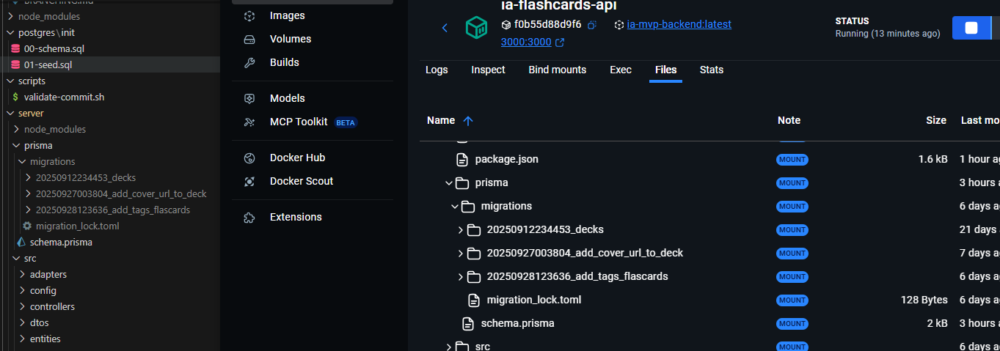

# IA Flashcards

Aplicación de flashcards con integración de IA para generación automática de tarjetas.

## Requisitos Previos

- Docker Desktop
  - Windows: [Descargar Docker Desktop para Windows](https://www.docker.com/products/docker-desktop)
  - macOS: [Descargar Docker Desktop para Mac](https://www.docker.com/products/docker-desktop)
  - Linux: [Instrucciones de instalación para Linux](https://docs.docker.com/engine/install/)
- Git
  - Windows: [Descargar Git para Windows](https://git-scm.com/download/win)
  - macOS: `brew install git`
  - Linux: `sudo apt-get install git` o equivalente
- PostgreSQL
  - Windows: [Descargar PostgreSQL para Windows](https://www.postgresql.org/download/windows/)
  - macOS: [Descargar PostgreSQL para macOS](https://www.postgresql.org/download/macosx/)
  - Linux: [Descargar PostgreSQL para Linux](https://www.postgresql.org/download/)

## Configuración Inicial

### Windows

1. Instalar WSL2 (Windows Subsystem for Linux):

   ```powershell
   wsl --install
   ```

2. Instalar Docker Desktop y asegurarse de que use WSL2 backend

   - En Docker Desktop: Settings > General > "Use WSL 2 based engine"

3. Clonar el repositorio:

   ```bash
   git clone <url-del-repo>
   cd project
   ```

4. Crear archivo .env:
   ```bash
   copy .env.example .env
   ```

### macOS/Linux

1. Clonar el repositorio:

   ```bash
   git clone <url-del-repo>
   cd project
   ```

2. Crear archivo .env:
   ```bash
   cp .env.example .env
   ```

## Ejecutar la Aplicación

1. Construir y levantar los contenedores:

   ```bash
   docker compose up --build
   ```

2. La aplicación estará disponible en:
   - Frontend: http://localhost:5173
   - Backend API: http://localhost:3000
   - Base de datos: localhost:5432

## Solución de Problemas

### Windows

1. Si hay problemas con los permisos en WSL:

   ```bash
   # En PowerShell como administrador
   wsl --shutdown
   wsl --start
   ```

2. Si Docker no puede acceder a los archivos:

   - Asegurarse de que el repositorio esté en el sistema de archivos de WSL
   - O habilitar la integración de WSL para la carpeta en Docker Desktop

3. Si hay problemas con los line endings:
   ```bash
   git config --global core.autocrlf input
   ```

### Problemas Comunes

1. Error "port is already in use":

   ```bash
   # Detener todos los contenedores
   docker compose down
   # Verificar y matar procesos usando los puertos
   netstat -ano | findstr "5173 3000 5432"  # Windows
   lsof -i :5173,:3000,:5432  # macOS/Linux
   ```

2. Error de conexión a la base de datos:

   - Verificar que las credenciales en .env coincidan con docker-compose.yml
   - Esperar ~30 segundos después de `docker-compose up` para que PostgreSQL inicie completamente

3. Error "@prisma/client did not initialize yet. Please run 'prisma generate' and try to import it again":

   - Este error ocurre cuando Prisma no ha generado correctamente el cliente.
   - Soluciones:
     - Dentro del contenedor backend:
       ```bash
       docker compose exec backend npx prisma generate
       ```
     - Alternativamente, apaga el backend (asegúrate de que Docker no esté activo) y ejecuta en tu terminal:
       ```bash
       npx prisma generate
       ```
       Si te solicita instalar Prisma, acepta la instalación y continúa.
   - Si el problema persiste, asegúrate de que el contenedor `backend` tenga acceso a los archivos de Prisma y que el volumen esté correctamente montado

4. Error "AuthenticationError: 401 Incorrect API key provided":
   - Este error indica que la API key de OpenAI es incorrecta, inválida o está mal configurada.
   - Solución:
     - Verifica que la variable `OPENAI_API_KEY` en tu archivo `.env` tenga una API key válida y sin espacios extra.
     - Puedes obtener una nueva API key en: https://platform.openai.com/account/api-keys
     - Reinicia el backend después de actualizar la clave:
       ```bash
       docker compose restart backend
       ```
     - Si usas Docker, asegúrate de que el archivo `.env` esté accesible dentro del contenedor

# Errores comunes con Docker y Prisma

## Error: The column `Deck.coverUrl` does not exist in the current database / Error: P3005

**Mensaje:**
```
The column `Deck.coverUrl` does not exist in the current database.
Error: P3005
The database schema is not empty. Read more about how to baseline an existing production database: https://pris.ly/d/migrate-baseline
```

**¿Por qué ocurre?**
- Prisma detecta que la base de datos ya tiene tablas/datos, pero nunca fue "baselined" para migraciones.
- Esto sucede cuando empiezas a usar Prisma Migrate en una base de datos existente.

**Solución 1:**
1. Identifica el nombre de la primera migración en `server/prisma/migrations/` (ejemplo: `20230920123456_init`).
2. Ejecuta en el contenedor backend:
   ```sh
   docker-compose exec backend npx prisma migrate resolve --applied <nombre_migracion>
   ```
3. Luego ejecuta:
   ```sh
   docker-compose exec backend npx prisma migrate deploy
   ```

**Importante:**
- El baseline solo se ejecuta una vez por base de datos. No lo pongas en scripts de arranque ni Dockerfile.
- Tus scripts de arranque deben usar solo:
  - `npx prisma migrate deploy` (para aplicar migraciones nuevas)
  - `npx prisma generate` (para generar el cliente)

**Ejemplo de script recomendado en `package.json`:**
```json
"dockerStart": "npx prisma migrate deploy && npx prisma generate && node src/index.js"
```

**En tu `docker-compose.yml` para backend:**
```yaml
command: sh -c "npm run dockerStart"
```
Begin Patch

# Reinicio completo del entorno Docker (desarrollo)

Si tienes problemas con migraciones, datos corruptos o simplemente quieres empezar desde cero, sigue estos pasos para borrar **todos** los contenedores, imágenes y volúmenes de Docker relacionados con el proyecto:

```bash
# Detén y elimina todos los contenedores y volúmenes del proyecto
docker-compose down -v

# (Opcional) Borra todas las imágenes de Docker del proyecto
docker image prune -a

 (Opcional) Borra todos los volúmenes de Docker (¡esto borra datos de TODOS tus proyectos!)
# docker volume prune


Luego, reconstruye y levanta todo desde cero:

```bash
docker-compose up --build -d
```

Esto garantiza que la base de datos esté completamente vacía y que las migraciones de Prisma se apliquen correctamente.

**Importante:**
 Si usabas scripts SQL en `postgres/init`, coméntalos o elimínalos si ahora usas Prisma para gestionar la estructura y datos.
 Usa el sistema de seed de Prisma para poblar datos de ejemplo.

**Documentación oficial:**
- https://www.prisma.io/docs/orm/migrate/troubleshooting#the-database-schema-is-not-empty
- https://www.prisma.io/docs/orm/reference/prisma-cli-reference#resolve

## Observaciones importantes sobre migraciones y sincronización

1. **Sincronización de migraciones entre entornos:**
   - Todos los entornos (local y Docker) deben tener exactamente los mismos archivos de migración en la carpeta `prisma/migrations` y aplicarlos en el mismo orden.
   - Si alguien genera migraciones en otro entorno, debe hacer commit y push de esos archivos.
   - Cuando otro desarrollador o el entorno Docker los reciba, debe aplicar esas migraciones en el mismo orden (Prisma lo hace automáticamente con `migrate deploy`).
   - Si los archivos de migración son iguales y están en el mismo orden, la estructura de la base de datos será igual en todos los entornos.
   

2. **Evita scripts SQL manuales para tablas gestionadas por Prisma:**
   - No uses scripts SQL en `postgres/init` para crear o poblar tablas que ahora gestiona Prisma.
   - Deja que Prisma cree y migre la base de datos con sus migraciones.
   - Si necesitas poblar datos de ejemplo, usa el sistema de seed de Prisma (`prisma/seed.js`).
   
## Desarrollo

- Los cambios en el código se reflejan automáticamente gracias a los volúmenes de Docker
- La base de datos persiste entre reinicios gracias al volumen postgres_data
- Los datos de prueba se cargan automáticamente en la primera ejecución

## Comandos Útiles

```bash
# Reconstruir contenedores
docker-compose up --build

# Ver logs
   docker compose logs -f

# Detener contenedores
   docker compose down

# Eliminar volúmenes (borra la base de datos)
   docker compose down -v

# Entrar a un contenedor
   docker compose exec backend sh
   docker compose exec frontend sh
   docker compose exec postgres psql -U postgres
```
